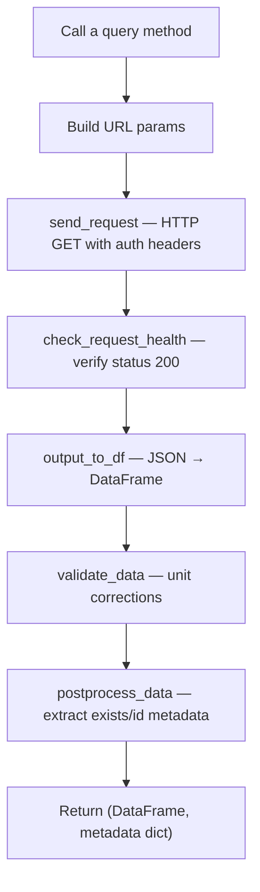
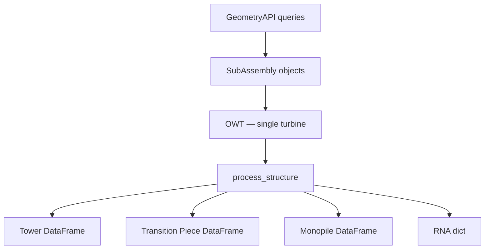

# Architecture and data flow

This page explains how the OWI Metadatabase SDK is organised internally
and how a typical API request flows from your code to a Pandas DataFrame.

## Package structure

```txt
owi.metadatabase/
├── io.py              # Base API class — auth, requests, JSON→DataFrame
├── geometry/
│   ├── io.py          # GeometryAPI — geometry-specific endpoints
│   ├── processing.py  # OWT, OWTs — structural assembly logic
│   └── structures.py  # Dataclasses for sub-assemblies and building blocks
├── locations/
│   └── io.py          # LocationsAPI — project site and asset location endpoints
└── _utils/
    ├── exceptions.py  # Custom exception hierarchy
    └── utils.py       # Shared helper functions
```

## Class hierarchy

All API clients inherit from the base `API` class in `io.py`:

```
API (io.py)
├── GeometryAPI (geometry/io.py)
└── LocationsAPI (locations/io.py)
```

`GeometryAPI` additionally creates an internal `LocationsAPI` instance so
it can resolve project sites and asset locations without requiring the
caller to manage two clients.

## Request lifecycle

Every query method follows the same pipeline implemented in
`API.process_data()`:



1. **Build URL params** — each `get_*` method assembles endpoint-specific
   query parameters and merges in any extra `**kwargs` the caller provides.
2. **send_request** — dispatches an authenticated `requests.get()` call
   using either token headers or HTTP Basic Auth.
3. **check_request_health** — raises `APIConnectionError` if the response
   status code is not 200.
4. **output_to_df** — decodes the JSON response body into a Pandas
   DataFrame.
5. **validate_data** — applies domain-specific corrections (e.g. fixing
   sub-assembly z-position units that arrive in millimetres instead of
   metres).
6. **postprocess_data** — inspects the DataFrame to set the `"existance"`
   flag and, for single-record queries, extracts the record `"id"`.
7. **Return** — the query method wraps the DataFrame and metadata into a
   dictionary with keys like `"data"`, `"exists"`, and optionally `"id"`.

## Authentication

The `API.__init__` constructor accepts three mutually exclusive credential
forms:

| Credential | How it is used |
|------------|---------------|
| `token` | Sent as `Authorization: Token <value>` header |
| `header` | A pre-built `{"Authorization": "Token ..."}` dict |
| `uname` + `password` | Sent via `requests` HTTP Basic Auth |

If none are provided, `InvalidParameterError` is raised at construction
time.

## Geometry processing pipeline

Raw geometry data from the API is flat: sub-assemblies, building blocks,
tubular sections, and masses arrive as separate DataFrames. The
processing layer assembles them into coherent structural models:



- **`OWT`** — wraps the sub-assembly data for a single turbine and
  exposes processed component DataFrames after `process_structure()`.
- **`OWTs`** — batch-processes a list of turbines and concatenates the
  results.

## Return value conventions

All public query methods return a dictionary. The standard keys are:

| Key | Type | Description |
|-----|------|-------------|
| `"data"` | `pd.DataFrame` | The query result |
| `"exists"` | `bool` | Whether any matching records were found |
| `"id"` | `int \| None` | Record ID (single-record queries only) |

This convention is consistent across the core SDK and all extension
packages (`owi-metadatabase-soil`, `owi-metadatabase-results`,
`owi-metadatabase-shm`).
