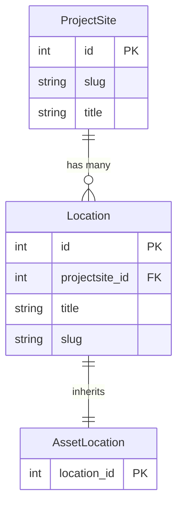
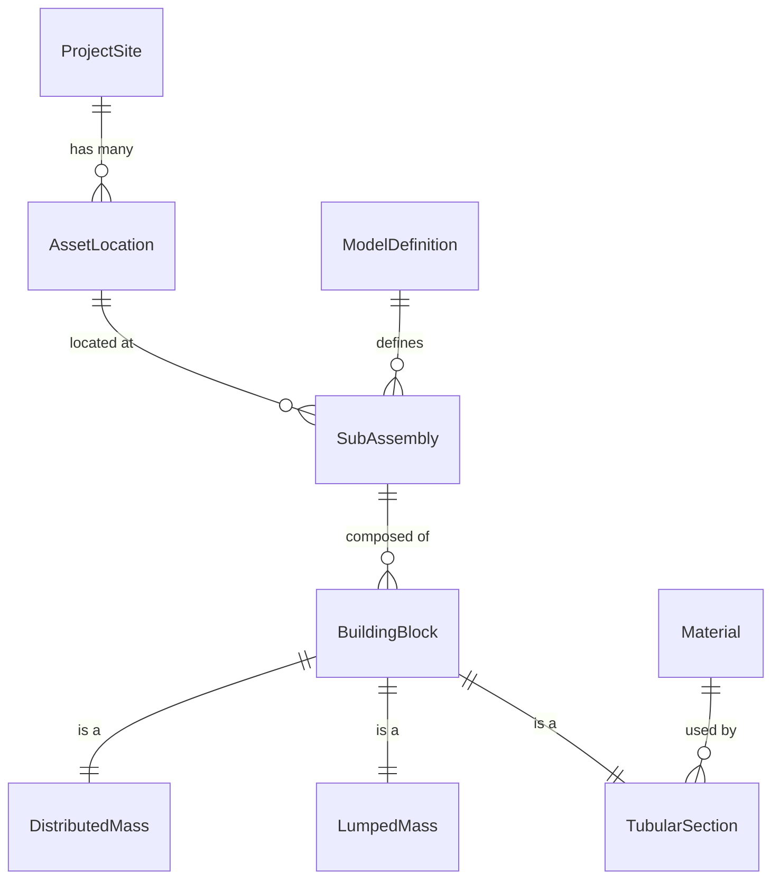

# Data model

This page describes the entity relationships behind the OWI Metadatabase
API. Understanding the data model helps you choose the right query methods
and filter parameters.

## Locations domain

The locations domain has three entities arranged in a simple hierarchy:

- **ProjectSite** — a wind farm or project (e.g. "Nobelwind").
- **Location** — a named position within a project site.
- **AssetLocation** — a specialisation of Location representing a
  physical asset such as a turbine foundation.

The SDK's `LocationsAPI` exposes `get_projectsites()`,
`get_assetlocations()`, and their detail variants to query these entities.

## Geometry domain

The geometry domain is richer, with six main entities:

- **ModelDefinition** — a named structural model for a project, selected
  by project site title.
- **SubAssembly** — a major structural component (tower TW, transition
  piece TP, monopile MP) belonging to both a model definition and an
  asset location.
- **BuildingBlock** — a segment within a sub-assembly. Each building
  block has exactly one of three specialisations:
    - **TubularSection** — a cylindrical segment with a material reference.
    - **LumpedMass** — a point mass.
    - **DistributedMass** — a distributed mass.
- **Material** — steel grades and their mechanical properties, referenced
  by tubular sections.

## How the SDK maps to the data model

| SDK method | Entity | Filter path |
|-----------|--------|-------------|
| `LocationsAPI.get_projectsites()` | ProjectSite | `title` |
| `LocationsAPI.get_assetlocations(projectsite=...)` | AssetLocation | `projectsite__title` |
| `GeometryAPI.get_model_definitions(projectsite=...)` | ModelDefinition | `site` |
| `GeometryAPI.get_subassemblies(projectsite=..., assetlocation=...)` | SubAssembly | `asset__projectsite__title`, `asset__title` |
| `GeometryAPI.get_buildingblocks(projectsite=..., assetlocation=...)` | BuildingBlock | `sub_assembly__asset__projectsite__title` |
| `GeometryAPI.get_materials()` | Material | (no filter) |

## Processing layer

The `OWT` and `OWTs` classes consume the raw DataFrames returned by
`GeometryAPI` and assemble them into component-level views:

| Processing class | Input | Output |
|-----------------|-------|--------|
| `OWT` | Sub-assembly objects for one turbine | `.tower`, `.tp`, `.mp`, `.rna` DataFrames |
| `OWTs` | List of turbine names + API client | Concatenated DataFrames across all turbines |

The processing step resolves the sub-assembly → building-block →
tubular-section chain and organises the rows by sub-assembly type
(`TW`, `TP`, `MP`).
