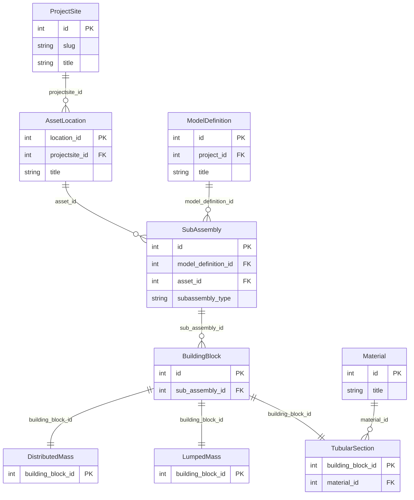
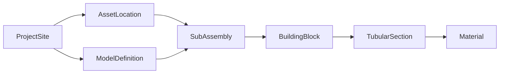

# Geometry QuerySet Examples

These examples map the geometry schema that the SDK exposes through
`GeometryAPI` and the geometry processing structures in this workspace.
The join paths are taken from the live client code and tests, not from a
simplified diagram.

One detail matters immediately: the checked-in SDK exercises the
`SubAssembly` to asset-location relation with the Django filter path
`asset__...`, even though some higher-level schema notes call the field
`asset_location`. The examples below follow the concrete filter path used
by the backend-facing code in this workspace.

## Shell Setup

```python
# Geometry and location models used throughout the examples.
from django.db.models import Prefetch

from geometry.models import (
    BuildingBlock,
    DistributedMass,
    LumpedMass,
    Material,
    ModelDefinition,
    SubAssembly,
    TubularSection,
)
from locations.models import AssetLocation, ProjectSite
```

## Data Model Overview

- `ModelDefinition` belongs to a project record; the geometry client
  resolves it from a project site through `GeometryAPI.get_model_definitions()`.
- `SubAssembly` belongs to both a `ModelDefinition` and an asset row, and
  the SDK filters that relation as `asset__projectsite__title` and
  `asset__title`.
- `BuildingBlock` belongs to `SubAssembly` through `sub_assembly`.
- `TubularSection` belongs to `BuildingBlock` and `Material`.
- `LumpedMass` and `DistributedMass` are building-block specializations
  keyed by the same building-block row.

## Entity Relationship Diagram



## Query Flow



## Basic Queries

```python
# Retrieve every model definition.
ModelDefinition.objects.all()

# Scope model definitions to the Nobelwind project hierarchy.
ModelDefinition.objects.filter(project__projectsite__slug="nobelwind")

# Pull all transition-piece subassemblies for Nobelwind.
SubAssembly.objects.filter(
    asset__projectsite__slug="nobelwind",
    subassembly_type="TP",
)

# Retrieve building blocks for one subassembly.
BuildingBlock.objects.filter(sub_assembly_id=235)
```

## Deep Joins

```python
# Start at the deepest structural level and walk back to the project site.
SubAssembly.objects.filter(
    model_definition__project__projectsite__slug="nobelwind"
)

# Match the exact path used by GeometryAPI.get_buildingblocks(projectsite=...).
BuildingBlock.objects.filter(
    sub_assembly__asset__projectsite__title="Nobelwind"
)

# Traverse from project site to the material rows referenced by tubular
# sections on the related building blocks.
Material.objects.filter(
    tubularsection__building_block__sub_assembly__asset__projectsite__slug="nobelwind"
).distinct()
```

## Related Fetching

```python
# Join the owning model definition and asset row when loading subassemblies.
SubAssembly.objects.select_related("model_definition", "asset").filter(
    asset__projectsite__slug="nobelwind"
)

# Join all forward relations needed to inspect one tubular section.
TubularSection.objects.select_related(
    "building_block",
    "building_block__sub_assembly",
    "building_block__sub_assembly__asset",
    "material",
)
```

## Reverse Relations And Prefetching

```python
# Walk from an asset location down to subassemblies, then prefetch the
# related building blocks in the same request cycle.
AssetLocation.objects.filter(projectsite__slug="nobelwind").prefetch_related(
    Prefetch("subassembly_set", queryset=SubAssembly.objects.prefetch_related("buildingblock_set"))
)

# This is the project-site level traversal many views eventually need.
ProjectSite.objects.filter(slug="nobelwind").prefetch_related(
    "location_set__assetlocation__subassembly_set"
)
```

## Specialized Building-Block Types

```python
# Tubular sections carry the material FK.
TubularSection.objects.filter(
    building_block__sub_assembly__asset__title="BBA01"
).select_related("material")

# Mass blocks are separate tables keyed by the building-block row.
LumpedMass.objects.filter(
    building_block__sub_assembly__asset__title="BBA01"
)

DistributedMass.objects.filter(
    building_block__sub_assembly__asset__title="BBA01"
)
```

## SDK Alignment

The core SDK forwards these same join paths to the backend.

```python
from owi.metadatabase.geometry.io import GeometryAPI

api = GeometryAPI(token="your-api-token")

# The SDK turns `projectsite="Nobelwind"` into
# `asset__projectsite__title="Nobelwind"` for the subassembly endpoint.
api.get_subassemblies(projectsite="Nobelwind")

# The SDK turns `assetlocation="BBA01"` into `asset__title="BBA01"`.
api.get_subassemblies(assetlocation="BBA01", subassembly_type="TW")

# Building-block filtering uses the deeper `sub_assembly__asset__...` path.
api.get_buildingblocks(projectsite="Nobelwind", assetlocation="BBA01")
```

When you need the model definition selected exactly the way the SDK does,
match its scope first and then filter by title.

```python
# QuerySet equivalent of GeometryAPI.get_modeldefinition_id(...).
ModelDefinition.objects.filter(
    project__projectsite__title="Nobelwind",
    title="as-built Belwind",
)
```

## Live Route Validation

The live dev geometry list route was validated on 2026-03-23.

- Working live route: `/api/v1/geometry/routes/modeldefinitions/`
- Observed 404 route: `/api/v1/geometry/routes/modeldefinition/`
- Confirmed working list filters: `site`, `title`
- Confirmed examples: `site=Belwind`, `site=Nobelwind`,
  `title=as-built Belwind`
- Confirmed empty-result behavior: `title=does-not-exist` returns `[]`
- Observed as ineffective on this list route: `project`, `id`

This aligns with the checked-in SDK implementation: `GeometryAPI`
requests the plural `modeldefinitions` route and scopes it with
`site=...`.

```python
from owi.metadatabase.io import API

api = API(
    api_root="https://owimetadatabase-dev.azurewebsites.net/api/v1/geometry/routes/",
    token="your-api-token",
)

api.send_request("modeldefinitions/", {"site": "Nobelwind"}).json()
```
