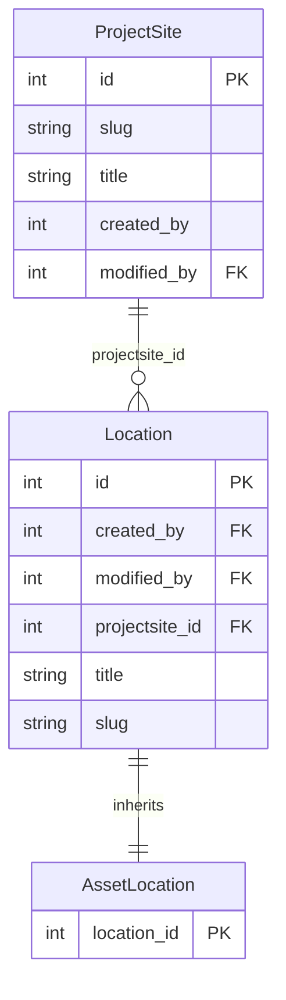
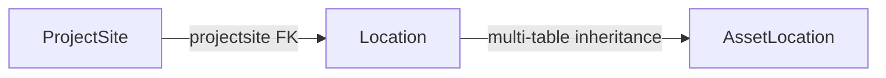

# Location QuerySet Examples

These examples are written for the backend Django models that power the
locations endpoints exposed by the SDK. They use the exact schema and
join/filter paths that are visible in this workspace through
`LocationsAPI`, its docstrings, and its tests.

The server-side model declarations are not checked into this workspace,
so reverse-manager examples assume Django's default accessors where no
custom `related_name` is visible. The forward paths and filter names are
the ones exercised by the SDK today.

## Shell Setup

Run the snippets in `python manage.py shell` or `python manage.py shell_plus`.

```python
# Core imports for the locations app.
from django.db.models import Count

from locations.models import AssetLocation, Location, ProjectSite
```

## Data Model Overview

- `ProjectSite` is the root object for a site such as the real
  `Nobelwind` record with `slug="nobelwind"`.
- `Location` stores the shared location row and has a foreign key to
  `ProjectSite` through `projectsite`.
- `AssetLocation` is a Django multi-table-inheritance child of
  `Location`; its primary key is the parent `Location` row.
- The SDK confirms the site-to-location join path by sending
  `projectsite__title=...` when `LocationsAPI.get_assetlocations()` is
  scoped to a project site.

## Entity Relationship Diagram



## Query Flow



## Basic Queries

```python
# List every project site row.
ProjectSite.objects.all()

# Fetch the real Nobelwind record by slug.
ProjectSite.objects.filter(slug="nobelwind")

# Inspect the base location rows that belong to Nobelwind.
Location.objects.filter(projectsite__slug="nobelwind")

# Query only the inherited asset-location rows for the same site.
AssetLocation.objects.filter(projectsite__slug="nobelwind")
```

## Related Fetching

```python
# Pull the parent site in the same query for each location row.
Location.objects.select_related("projectsite")

# AssetLocation inherits Location, so inherited Location fields are still
# available and can be joined with select_related.
AssetLocation.objects.select_related("projectsite").filter(
    projectsite__slug="nobelwind"
)
```

## Reverse Relations

```python
# Start from one project site and walk back to its base locations.
projectsite = ProjectSite.objects.get(slug="nobelwind")
projectsite.location_set.all()

# Walk from the parent Location row to the AssetLocation child row.
location = Location.objects.select_related("projectsite").get(
    projectsite__slug="nobelwind",
    title="BBA01",
)
location.assetlocation
```

## Inheritance-Aware Queries

```python
# Multi-table inheritance lets you filter AssetLocation through inherited
# Location columns such as projectsite and title.
AssetLocation.objects.filter(
    projectsite__slug="nobelwind",
    title__startswith="BB",
)

# When you need both the site and its asset count, annotate at the root.
ProjectSite.objects.annotate(location_count=Count("location")).filter(
    slug="nobelwind"
)
```

## Prefetching Traversals

```python
# Prefetch every base location row for the Nobelwind site.
ProjectSite.objects.filter(slug="nobelwind").prefetch_related("location_set")

# Prefetch the inherited asset rows when you know each Location will be
# accessed as an AssetLocation later in the request.
Location.objects.filter(projectsite__slug="nobelwind").prefetch_related(
    "assetlocation"
)
```

## SDK Alignment

The SDK uses Django-style backend filters directly. These two examples are
equivalent in intent.

```python
# Backend QuerySet executed in the Django project.
AssetLocation.objects.filter(projectsite__title="Nobelwind")
```

```python
# Equivalent SDK call from the external client.
from owi.metadatabase.locations.io import LocationsAPI

api = LocationsAPI(token="your-api-token")

# The SDK turns this into the backend filter `projectsite__title=Nobelwind`.
api.get_assetlocations(projectsite="Nobelwind")
```

You can also forward extra Django-style filters through the SDK.

```python
from owi.metadatabase.locations.io import LocationsAPI

api = LocationsAPI(token="your-api-token")

# Additional keyword arguments are passed through as backend filters.
api.get_assetlocations(
    projectsite="Nobelwind",
    title__startswith="BB",
)
```

## Live Route Validation

The live dev list route was validated on 2026-03-23 with authenticated
GET requests to `/api/v1/locations/routes/projectsite/`.

- Confirmed working list filter: `title`
- Confirmed examples: `title=Belwind`, `title=Nobelwind`
- Confirmed empty-result behavior: `title=not-a-site` returns `[]`
- Observed as ineffective on this list route: `slug`, `id`, `projectsite`

That matters because the QuerySet examples above describe backend model
access, while the list route exposes a narrower public filter surface.
For live route calls, prefer the exact title filter.

```python
from owi.metadatabase.io import API

api = API(
    api_root="https://owimetadatabase-dev.azurewebsites.net/api/v1/locations/routes/",
    token="your-api-token",
)

api.send_request("projectsite/", {"title": "Nobelwind"}).json()
```
